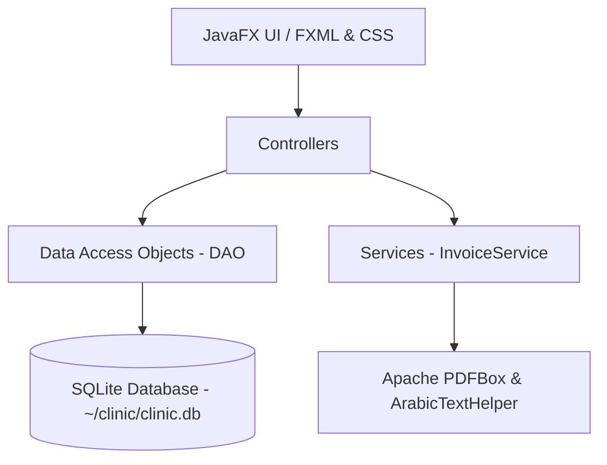

# Cabinet Nour El Islam — Clinic Management System (ERP)

A comprehensive desktop ERP application developed with **JavaFX** and **SQLite**, designed specifically for physical rehabilitation and motor therapy clinics (**Cabinet de Rééducation Fonctionnelle et Motrice**).

---

## 📋 Overview

**Cabinet Nour El Islam** streamlines daily clinical operations, from patient intake and treatment session tracking to financial dashboards, employee payroll checks, operating expense management, and professional PDF invoice generation with native bilingual support (French & Arabic).

---

## ✨ Key Features

### 📊 Financial Dashboard
- **Monthly Insights**: Real-time aggregation of session volume, expected revenue, actual revenue collected, and pending balance.
- **Cost Monitoring**: Consolidated view of staff payouts, operational bills, and direct supply sales.
- **Interactive Drill-Down**: Double-click modal inspection for granular breakdowns of expected and realized profit.

### 👤 Patient Management
- **Directory & Search**: Instant filterable patient roster.
- **Patient Profile**: Comprehensive overview of personal details, accumulated treatment charges, total payments, and remaining balances.
- **Treatment History**: Chronological timeline of clinical sessions and notes.
- **Therapy Plans (*Plans Thérapeutiques*)**: Multi-session treatment packages with tracking of allocated vs. remaining sessions and package completion status badges (`COMPLET`, `RESTE`, `AUCUNE SÉANCE`).

### 📅 Session Scheduling & Tracking
- **Daily Calendar View**: Session logs filtered by date with real-time daily totals.
- **Payment Status Tracking**: Visual status indicators for `PAYÉ` (Paid), `PARTIEL` (Partially Paid), and `IMPAYÉ` (Unpaid).
- **Flexible Association**: Sessions can either stand alone or be linked to a structured therapy plan.

### 📄 Bilingual PDF Invoicing
- **Custom Session Invoicing**: Interactive session selection dialog allowing clinic staff to select specific sessions for itemized billing.
- **Clinic Letterhead**: Professional A4 PDF generation with clinic branding, logo, and summary tables.
- **Arabic & French Font Engine**: Integrated `ArabicTextHelper` providing contextual Arabic letter reshaping (isolated, initial, medial, final forms), mandatory Lam-Alef ligatures, and bidirectional (RTL) visual reordering for proper rendering alongside Latin text in PDFBox.

### 🧑‍⚕️ Staff & Payroll Management
- **Employee Directory**: Worker records capturing national identity card numbers, job roles, birth information, and family status.
- **Payment Checks**: Issue and archive salary disbursements and payroll records filtered by month and year.

### 📑 Operating Expenses & Clinic Bills
- **Bill Accounting**: Track recurring clinic utility bills, equipment purchases, and operating costs.
- **Itemized Receipts**: Line-item breakdown (`BillItem`) specifying item name, quantity, and unit price.

### 🛒 Direct Clinic Sales
- **Product & Supply Tracking**: Register direct counter sales of medical supplies, orthotics, or rehabilitation equipment.

### 🔐 Authentication & Security
- **Role-Based Login**: User authentication against local database credentials.
- **Auto-Seeding**: Automatic initialization of default administrative credentials on first launch.

---

## 🛠️ Architecture & Tech Stack

| Component | Technology | Description |
| :--- | :--- | :--- |
| **Language** | Java 17 | Core runtime (compatible with JDK 17 to JDK 21+) |
| **UI Framework** | JavaFX 17 (`javafx-controls`, `javafx-fxml`) | Declarative FXML layouts with modular CSS styling |
| **Database** | SQLite via `sqlite-jdbc 3.45.1.0` | Embedded file database with enabled foreign key enforcement |
| **PDF Generation** | Apache PDFBox 3.0.5 | PDF invoice generation and rendering |
| **Text Processing** | Custom `ArabicTextHelper` & `java.text.Bidi` | Contextual glyph reshaping and bidirectional reordering |
| **Build System** | Apache Maven | Project lifecycle management and dependency resolution |

### Data Storage Architecture
- The SQLite database file is stored in the user's home directory:
  ```
  ~/clinic/clinic.db
  ```
- On first launch, `DatabaseInitializer` automatically applies DDL statements to create required tables and seeds the administrative account.

---

## 🏗️ System Architecture



---

## 📁 Project Structure

```
redicalClinic/
├── README.md
├── myerp/
│   ├── pom.xml                   # Maven project descriptor
│   ├── nbactions.xml             # NetBeans action configurations
│   └── src/
│       └── main/
│           ├── java/
│           │   ├── module-info.java
│           │   ├── com/myerp/
│           │   │   ├── Main.java              # Bootstrap entrypoint
│           │   │   └── Myerp.java             # JavaFX Application lifecycle
│           │   ├── config/
│           │   │   ├── DatabaseConfig.java    # SQLite connection handling
│           │   │   └── DatabaseInitializer.java # Schema creation & seeding
│           │   ├── controller/                # JavaFX FXML Controllers
│           │   │   ├── HomeController.java    # Main navigation frame
│           │   │   ├── DashboardController.java
│           │   │   ├── PatientController.java
│           │   │   ├── PatientDetailController.java
│           │   │   ├── SessionController.java
│           │   │   ├── WorkerController.java
│           │   │   ├── BillController.java
│           │   │   └── SoldController.java
│           │   ├── dao/                       # Data Access Objects (JDBC)
│           │   ├── model/                     # Domain entities & POJOs
│           │   ├── service/                   # Business logic & PDF generation
│           │   └── util/                      # Arabic text helpers
│           └── resources/
│               ├── css/                       # Modular CSS stylesheets
│               ├── fxml/                      # FXML screen layouts & dialogs
│               └── img/                       # Clinic branding & icon assets
└── openspec/                              # OpenSpec specification artifacts
```

---

## 🗄️ Database Entities

| Table | Description |
| :--- | :--- |
| `Users` | System credentials and roles (`fullName`, `userName`, `passWord`, `userType`) |
| `patient` | Patient contact info, cumulative cost, and cumulative paid balances |
| `therapyPlan` | Multi-session therapy programs linked to a patient with fixed package pricing |
| `session` | Individual appointments logging treatment notes, date, cost, and payment status |
| `worker` | Staff profiles including national identity card, job function, and contact info |
| `paymentCheck`| Payroll payout records associated with a worker |
| `bill` | Clinic operational expense records |
| `billItem` | Itemized line items belonging to a clinic bill |
| `sold` | Direct sales records of products/equipment |

---

## 🚀 Getting Started

### Prerequisites
- **Java Development Kit (JDK)**: Version 17 or higher (e.g. Eclipse Adoptium Temurin 17/21).
- **Apache Maven**: Version 3.8+ (or use IDE-bundled Maven in IntelliJ IDEA / NetBeans).

### Installation & Run

1. **Clone the repository**:
   ```bash
   git clone https://github.com/hedmi-san/redicalClinic.git
   cd redicalClinic/myerp
   ```

2. **Run using the JavaFX Maven Plugin**:
   ```bash
   mvn javafx:run
   ```

3. **Or compile and run directly**:
   ```bash
   mvn clean package
   mvn exec:java
   ```

---

## 🔑 Default Credentials

When launching the application for the first time on a fresh database, an administrative user is automatically generated:

| Username | Password | Role |
| :--- | :--- | :--- |
| `admin` | `admin123` | `Admin` |

> [!TIP]
> After your first login, make sure to configure any additional users or update administrative credentials as needed.
